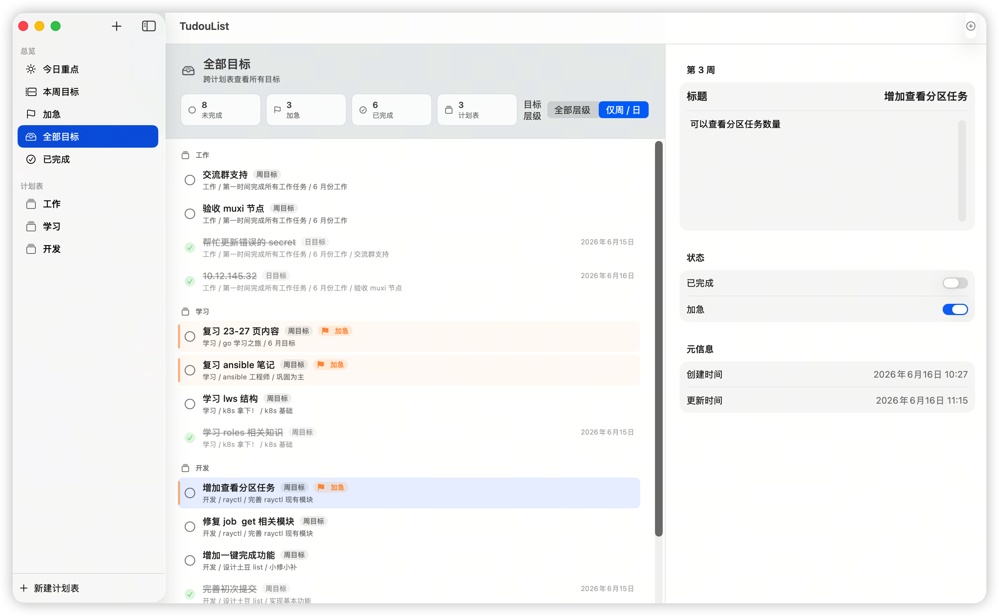
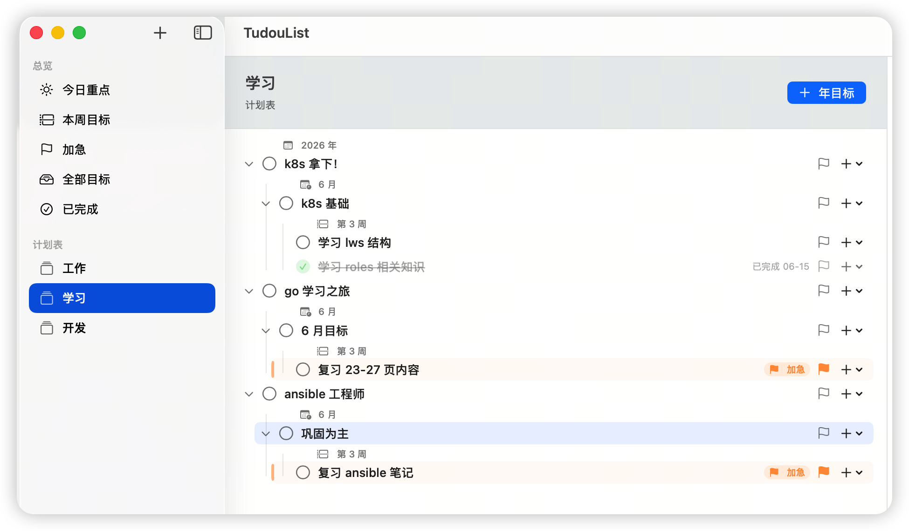

# TudouList

TudouList 是一个 macOS 原生 SwiftUI 计划表 / Todo / Goal Planning 应用。它面向层级化目标管理，支持从「计划表」拆解到「年目标 -> 月目标 -> 周目标 -> 日目标」，并提供跨计划表的总览视图。





## 已实现功能

- 多计划表管理：新增、重命名、删除计划表。
- 三栏 macOS 原生布局：左侧 Sidebar，中间目标列表 / 总览，右侧目标详情编辑。
- 总览 Smart List：支持「今日重点」「本周目标」「加急」「全部目标」「已完成」。
- 跨计划表展示：总览可以集中显示所有计划表里的相关目标，并展示所属计划表和父级路径。
- 总览层级筛选：支持「全部层级」和「仅周 / 日」，方便只查看更可执行的周目标、日目标。
- 目标层级：支持年、月、周、日四级目标；年下建月，月下可建周或日，周下建日。
- 目标编辑：支持标题、备注、完成状态、加急状态编辑。
- 自动保存：标题和备注输入后实时写回数据源，并通过 JSON 本地持久化。
- 完成时间：完成目标时自动写入 `completedAt`，取消完成时清空；中间列表显示完成日期。
- 层级展示：普通计划表内按年 / 月 / 周 / 日 递归展示，支持折叠 / 展开和连续 period 分组。
- 排序规则：同级目标中加急优先、未完成优先，其次按 `sortOrder` 和创建时间排序。
- 删除确认：删除计划表或目标前确认；删除目标会同时删除子目标。
- 本地持久化：使用 Codable + JSON 保存数据，关闭 App 后重新打开仍然存在。
- 浅色 / 深色模式：使用系统颜色与材质，跟随 macOS 外观。

## 总览规则

- 今日重点：显示所有未完成加急目标，并补充最近更新的未完成目标。后续可扩展 `scheduledDate` / `dueDate`。
- 本周目标：显示未完成的周目标，以及周目标下的日目标。
- 加急：显示所有加急目标，未完成在前。
- 全部目标：按计划表分组显示所有目标。
- 已完成：按完成时间倒序显示已完成目标。

## 主要文件结构

```text
Package.swift
Sources/TudouList/
  TudouListApp.swift
  Models/
    Goal.swift
    GoalLevel.swift
    GoalLevelFilter.swift
    OverviewKind.swift
    OverviewStats.swift
    PlanList.swift
    SidebarSelection.swift
  Stores/
    PlanningStore.swift
  Views/
    ContentView.swift
    EmptyOverviewView.swift
    EmptyStateView.swift
    GoalBoardView.swift
    GoalDetailView.swift
    GoalRowView.swift
    OverviewContentView.swift
    OverviewGoalRowView.swift
    OverviewStatsView.swift
    PlanSidebarView.swift
```

## 后续可扩展方向

- 拖拽调整同级目标顺序，并写回 `sortOrder`。
- 为计划表增加描述编辑入口和统计信息。
- 为目标增加 `scheduledDate` / `dueDate`，让今日重点和本周视图更精确。
- 增加目标搜索、更多筛选和按日期聚合视图。
- 增加快捷键，例如快速新建年目标 / 下一级目标。
- 增加单元测试，覆盖 Store 的层级删除、排序、总览查询和完成状态逻辑。
